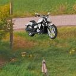
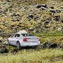

# Using CNNs for Vehicle Classification

As a starter project for BVC, I decided to create a CNN that learns to classify various images of vehicle types. I also used a custom dataset I made by placing images of vehicles as the foreground onto a random 128 x 128 crop of a landscape background, then augmenting the images.

The onboarding document mentioned that it was important to track *how* I completed this project. I outlined my learning process and how I built up to this project in the google document below. 

https://docs.google.com/document/d/1ROZzTwASKhRkDvESkVaY4mZ_gMYwPbnKHhf1rgN9YE8/edit?usp=sharing

In summary, I first learned/refreshed what I needed to know before testing my knowledge by looking at a CNN trained on MNIST. From there, I challenged myself to build a CNN that was trained on CIFAR-10. Afterwards, I learned to create my own dataset and used what I learned building the CIFAR-10 to build the vehicle classification CNN. 

<!-- GETTING STARTED -->
## Getting Started

### Prerequisites

This program runs on a environment using Python 3.11.0. I used venv to create the environment, though conda should also suffice.

* Before running, make sure the following packages are installed:

    ```sh
    pip install torch torchvision tensorboard
    ```

### Optional (But Recommended)

I used TensorBoard to track learning rate, accuracy, and loss. If you would like to also track these variables and activate TensorBoard, open a new terminal and paste the line below. Afterwards, go to http://localhost:6006/.

* Running TensorBoard:

    ```sh
    tensorboard --logdir=runs
    ```

For running on a GPU using CUDA, make sure the PyTorch version with CUDA is installed.

* Running on GPU via CUDA:

    ```sh
    pip install torch torchvision --index-url https://download.pytorch.org/whl/cu121
    ```

If you would like to create your own testing/training data using image_overlay.py, make sure to change the foreground, background, and output directories accordingly.

## Dataset Creation

I downloaded various images of motorcycles, cars, pickup trucks, and semi-trucks with transparent backgrounds. Since some of the backgrounds were not actually transparent, I put all of the images through a background remover website. I then wrote a script that scrapes landscape backgrounds from a website with no copyright images (https://unsplash.com). 

The script downloads the desired number of images and takes a random 128 x 128 crop of the images. The script then takes a foreground vehicle image at random and pastes it onto a random background image. Here are some examples of generated images:

&nbsp;&nbsp;&nbsp;&nbsp;&nbsp;&nbsp;&nbsp;&nbsp;&nbsp;&nbsp;
&nbsp;&nbsp;&nbsp;&nbsp;&nbsp;&nbsp;&nbsp;&nbsp;&nbsp;&nbsp;

&nbsp;&nbsp;&nbsp;&nbsp;&nbsp;&nbsp;&nbsp;&nbsp;&nbsp;&nbsp;



The foreground and background images for both testing and training are in the createdata folder. The script pulls from this folder and generates the 128 x 128 images to train/test on in the customdata folder. 


## CNN Creation

My model was heavily inspired by the model I made for the CIFAR-10 dataset. This model can be found and run in cifar10modelv6.py. For this model, I organized it to have three components and a final classification. Each component has a convolutional layer, batch normalization, activation function, max pooling, and residual block sequence. In layers 1, 2, and 3, the 
