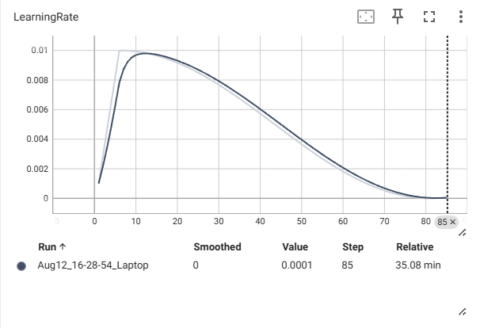

# Training a CNN to Classify Vehicle Types

As a starter project for BVC, I decided to create a CNN that learns to classify various images of vehicle types. I also used a custom dataset I made by placing images of vehicles as the foreground onto a random 128 x 128 crop of a landscape background, then augmenting the images.

In summary, I first learned/refreshed what I needed to know before testing my knowledge by looking at a CNN trained on MNIST. From there, I challenged myself to build a CNN that was trained on CIFAR-10. Afterwards, I learned to create my own dataset and used what I learned building the model trained on CIFAR-10 to build the vehicle classification CNN. 

The onboarding document mentioned that it was important to track *how* I completed this project. I outlined my learning process and how I built up to this project in the google document below. It's a bit long since I used it to track the changes I made to the CIFAR-10 trained CNN, but I provided it to hopefully give a general sense for how I built up my knowledge before starting this vehicle classification project.

https://docs.google.com/document/d/1ROZzTwASKhRkDvESkVaY4mZ_gMYwPbnKHhf1rgN9YE8/edit?usp=sharing

<!-- GETTING STARTED -->
## Getting Started

NOTE: The readmeimgs folder consists of images for this README and are not important to the datasets.

### Prerequisites

This program runs on a environment using Python 3.11.0. I used venv to create the environment, though conda should also suffice.

* Before running, make sure the following packages are installed:

    ```sh
    pip install torch torchvision tensorboard
    ```

To run the vehicle classifier, run vehicle_classification_cnn.py. To run the model trained on CIFAR-10, run cifar10modelv6.py.

### Optional (But Recommended)

I used TensorBoard to track learning rate, accuracy, and loss. If you would like to also track these variables and activate TensorBoard, open a new terminal and paste the line below. Afterwards, go to http://localhost:6006/.

* Running TensorBoard:

    ```sh
    tensorboard --logdir=runs
    ```

For running on a GPU using CUDA, make sure the PyTorch version with CUDA is installed.

* Running on GPU via CUDA:

    ```sh
    pip install torch torchvision --index-url https://download.pytorch.org/whl/cu121
    ```

If you would like to create your own testing/training data using image_overlay.py, make sure to change the foreground, background, and output directories accordingly.

## Dataset Creation

I downloaded various images of motorcycles, cars, pickup trucks, and semi-trucks with transparent backgrounds. Since some of the backgrounds were not actually transparent, I put all of the images through a background remover website. I then wrote a script that scrapes landscape backgrounds from a website with no copyright images (https://unsplash.com). 

The script downloads the desired number of images and takes a random 128 x 128 crop of the images. The script then takes a foreground vehicle image at random and pastes it onto a random background image. Here are some examples of generated images of a motorcycle, car, and pick-up truck (in that order):

&nbsp;&nbsp;&nbsp;&nbsp;&nbsp;&nbsp;&nbsp;&nbsp;&nbsp;&nbsp;

&nbsp;&nbsp;&nbsp;&nbsp;&nbsp;&nbsp;&nbsp;&nbsp;&nbsp;&nbsp;

&nbsp;&nbsp;&nbsp;&nbsp;&nbsp;&nbsp;&nbsp;&nbsp;&nbsp;&nbsp;


The foreground and background images for both testing and training are in the createdata folder. The script pulls from this folder and generates the 128 x 128 images to train/test on in the customdata folder. I also augmented the data using randomcrop, colorjitter, and horizontal flips.

Each class has 40 foregrounds in the training data and 10 foregrounds in the testing data. The testing data total has 150 images each per class and the training data has 500 images each per class.


## CNN Creation

My model was heavily inspired by the model I made for the CIFAR-10 dataset. This model can be found and run in cifar10modelv6.py. For this model, I organized it to have three components and a final classification. Each component is in the order of: 
1. Convolutional layer 
2. Batch normalization 
3. Activation function (ReLU)
4. Max pooling 
5. Residual block sequence 
6. Inception module
7. Convolutional layer

### Components

Components 1-4 go in the order 3 -> 32, 32 -> 64, 64 -> 128, 128 -> 256. Note that the inception module produces 88 outputs, so the final convolutional layer in the component accounts for this. For example, say we wanted 32 -> 64. The model goes 32 -> 64, then 64 -> 88 in the inception module, and then 88 -> 64. The first convolutional layer in the component has a 3x3 kernel while the second has a 1x1 kernel. 

Also, the residual block sequence has 2 ResNet blocks each and max pooling is 2x2. 

### Final Classification

Here's how the final classification is organized:

1. Outputs mapped to a 512 length vector
2. Batch normalization applied
3. ReLU applied
4. Dropout applied (rate = 0.5)
5. Mapping from 512 length vector to 3 logits

Dropout rate of 0.5 is applied after the final classification and the highest value logit is chosen.

## Results

Below is the data gathered from the CNN. 
- The black graph is the CNN only trained on motorcycles and cars
- The purple graph is the CNN trained on motorcycles, cars, and pick-up trucks
- The cyan graph is the same as the purple, but run for 85 epochs instead of 60


&nbsp;&nbsp;&nbsp;&nbsp;&nbsp;&nbsp;&nbsp;&nbsp;&nbsp;&nbsp;
&nbsp;&nbsp;&nbsp;&nbsp;&nbsp;&nbsp;&nbsp;&nbsp;&nbsp;&nbsp;

&nbsp;&nbsp;&nbsp;&nbsp;&nbsp;&nbsp;&nbsp;&nbsp;&nbsp;&nbsp;
&nbsp;&nbsp;&nbsp;&nbsp;&nbsp;&nbsp;&nbsp;&nbsp;&nbsp;&nbsp;

&nbsp;&nbsp;&nbsp;&nbsp;&nbsp;&nbsp;&nbsp;&nbsp;&nbsp;&nbsp;
&nbsp;&nbsp;&nbsp;&nbsp;&nbsp;&nbsp;&nbsp;&nbsp;&nbsp;&nbsp;


I wanted to see if I could increase the accuracy to consistently stay above 80% accuracy. I added a dropout rate of 0.3 after each ResNet block sequence, which is depicted by the gray graph. The model seemed to underperform, so I adjusted the cosine annealing from a period of 20 epochs to 85, which is depicted in the orange graph.


&nbsp;&nbsp;&nbsp;&nbsp;&nbsp;&nbsp;&nbsp;&nbsp;&nbsp;&nbsp;
&nbsp;&nbsp;&nbsp;&nbsp;&nbsp;&nbsp;&nbsp;&nbsp;&nbsp;&nbsp;

&nbsp;&nbsp;&nbsp;&nbsp;&nbsp;&nbsp;&nbsp;&nbsp;&nbsp;&nbsp;
&nbsp;&nbsp;&nbsp;&nbsp;&nbsp;&nbsp;&nbsp;&nbsp;&nbsp;&nbsp;

&nbsp;&nbsp;&nbsp;&nbsp;&nbsp;&nbsp;&nbsp;&nbsp;&nbsp;&nbsp;
&nbsp;&nbsp;&nbsp;&nbsp;&nbsp;&nbsp;&nbsp;&nbsp;&nbsp;&nbsp;


Despite the orange model still underperforming below 80% accuracy, but adjusting the cosine annealing helped the model. I removed the dropout rate of 0.3 after the ResNet block sequences but kept the adjusted cosine annealing. This seemed to work very well as depicted in the graphs below.

Side Note: At one point, I tried to adjust the batch size to be smaller, but the model ended up not learning and plateauing at 33% accuracy. I ended up keeping the batch size as 64.


&nbsp;&nbsp;&nbsp;&nbsp;&nbsp;&nbsp;&nbsp;&nbsp;&nbsp;&nbsp;
&nbsp;&nbsp;&nbsp;&nbsp;&nbsp;&nbsp;&nbsp;&nbsp;&nbsp;&nbsp;

&nbsp;&nbsp;&nbsp;&nbsp;&nbsp;&nbsp;&nbsp;&nbsp;&nbsp;&nbsp;
&nbsp;&nbsp;&nbsp;&nbsp;&nbsp;&nbsp;&nbsp;&nbsp;&nbsp;&nbsp;

&nbsp;&nbsp;&nbsp;&nbsp;&nbsp;&nbsp;&nbsp;&nbsp;&nbsp;&nbsp;
&nbsp;&nbsp;&nbsp;&nbsp;&nbsp;&nbsp;&nbsp;&nbsp;&nbsp;&nbsp;


The model consistently rested at the mid-80% accuracy mark and is the current model. In addition, testing and training loss seemed to be closer than previous models and the model was trained in the same time that it took to test the other models.

## Final Thoughts

A similar model to this proved to be successful when trained on CIFAR-10 by hovering consistently above 90% accuracy. I think for this current model to also break past 90% accuracy, I would have to add more vehicle foregrounds that it can train on, since currently there are only 40 for each class in the training data and 10 in the testing data. The testing data has 450 images total and the training data has 1500 images total. CIFAR-10 was considered a small dataset with 50,000 images total, meaning to increase the accuracy of the model I would have to look to adding more data to train on. However, the model currently seems to be decently effective at classifying the vehicles.

For the future, I might try to see if I can visualize the latent space of the model using t-SNE or UMAP. This would allow to see what the model is seeing before logit is chosen. Also, I used the same color normalization that was used on CIFAR-10, which might have led to some accuracy loss. I might also look into how to find the average color over each RGB for my dataset. Finally, another consideration might be to scrape images from a site like unsplash to find foregrounds of motorcycles, then use an api from a remove background tool to mass remove the backgrounds from the foregrounds in order to use them. This would be similar to how I used an api to get background images, just this time for foregrounds and for removing non-freground objects from them.